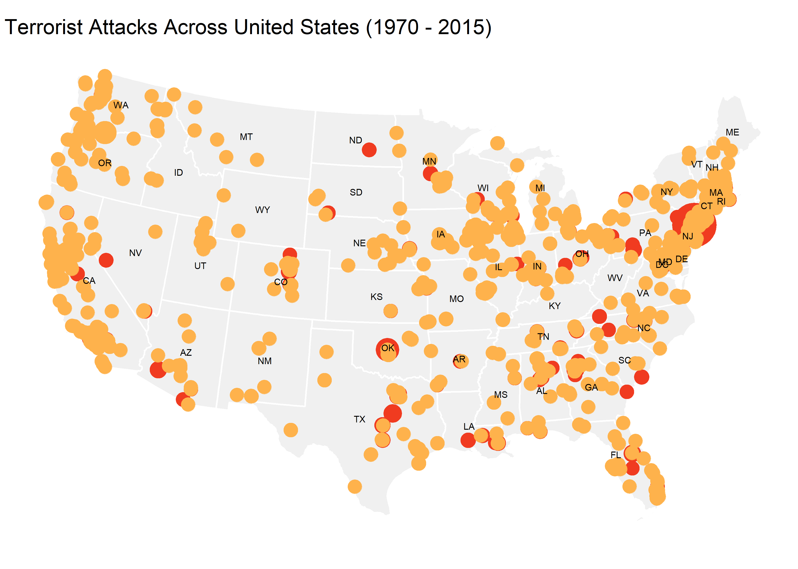
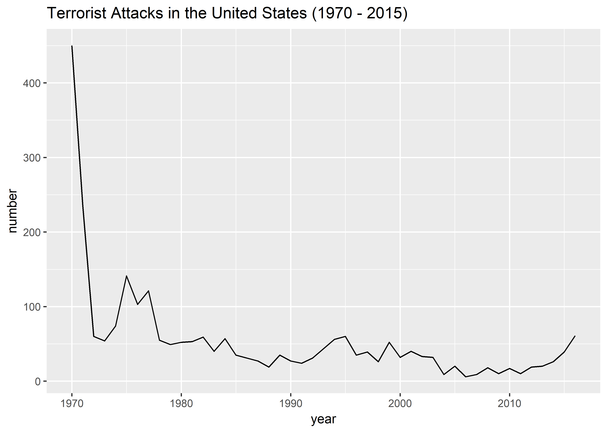
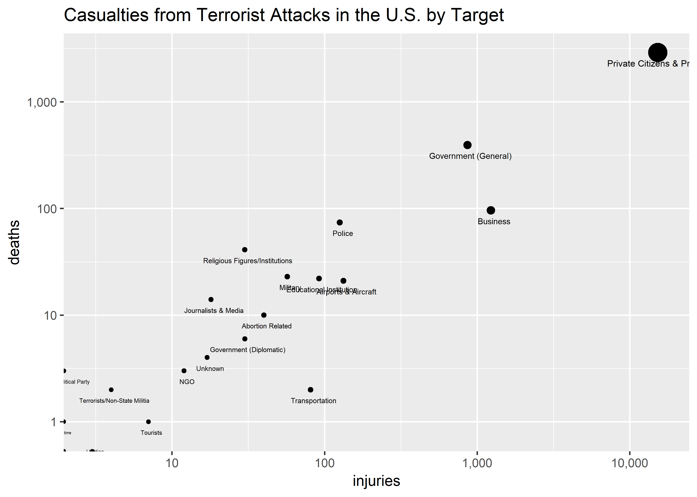

US Terrorist Attacks
================
Christopher Oh
2017-11-20

-   [Preparing the dataset](#preparing-the-dataset)
-   [Map of the terrorist attacks in the U.S.](#map-of-the-terrorist-attacks-in-the-u.s.)
-   [Terrorist attack occurences by year](#terrorist-attack-occurences-by-year)
-   [Plot of casualties (deaths + injuries) from terrorist attacks in the U.S.](#plot-of-casualties-deaths-injuries-from-terrorist-attacks-in-the-u.s.)

``` r
# Libraries
library(tidyverse)
library(stringr)
library(sf)
library(plotly)

# Map colors
MAP_COLOR <- c("#f03b20", "#feb24c")
```

These visulizations were inspired by Abigail Larion's work using the Global Terrorism Database on Kaggle [1].

Preparing the dataset
---------------------

-   Exclude regions that are not compatible with the geo visualization.
-   Transform the dataset into a simple features object using the lat-long coordinates provided.

``` r
us_attacks <-
  read_csv(path_attacks) %>% 
  unite(date, iyear, imonth, iday, sep = "-") %>% 
  filter(
    longitude < 0,
    country == 217L,
    !provstate %in% c("Alaska", "Hawaii", "Puerto Rico", "Unknown")
  )
```

    ## Parsed with column specification:
    ## cols(
    ##   .default = col_character(),
    ##   eventid = col_double(),
    ##   iyear = col_integer(),
    ##   imonth = col_integer(),
    ##   iday = col_integer(),
    ##   extended = col_integer(),
    ##   country = col_integer(),
    ##   region = col_integer(),
    ##   latitude = col_double(),
    ##   longitude = col_double(),
    ##   specificity = col_integer(),
    ##   vicinity = col_integer(),
    ##   crit1 = col_integer(),
    ##   crit2 = col_integer(),
    ##   crit3 = col_integer(),
    ##   doubtterr = col_integer(),
    ##   alternative = col_integer(),
    ##   multiple = col_integer(),
    ##   success = col_integer(),
    ##   suicide = col_integer(),
    ##   attacktype1 = col_integer()
    ##   # ... with 44 more columns
    ## )

    ## See spec(...) for full column specifications.

``` r
us_attacks <-
  us_attacks %>% 
  mutate(
    ncount = us_attacks %>% select(nkill, nwound) %>% rowSums(na.rm = TRUE),
    death_or_no = ifelse(nkill < 1 | is.na(nkill), "No Deaths", "Death(s)")
  ) %>% 
  st_as_sf(
    coords = c("longitude", "latitude"),
    crs = 4032
  )
```

-   Use Albers projection for the state geometries.
-   Get the state abbreviations and set the locations to be at the centroid.

``` r
state_geo <-
  read_rds(path_state_geo) %>% 
  filter(!STATEFP %in% c("02" ,"15")) %>% 
  mutate(county_fips = as.integer(GEOID)) %>% 
  st_transform(crs = US_ALBERS) 

state_label <- 
  state_geo %>% 
  st_centroid() %>% 
  mutate(
    x = geometry %>% map_dbl(1),
    y = geometry %>% map_dbl(2)
  )
```

Map of the terrorist attacks in the U.S.
----------------------------------------

``` r
map_plot <-
  state_geo %>% 
  ggplot() +
  geom_sf(color = "white", fill = "#f0f0f0", size = .5) +
  geom_sf(
    aes(
      size = ncount,
      color = death_or_no,
      text = str_c(
        "City: ", city, "\n", 
        "Date: ", str_replace_na(date), "\n", 
        "Killed: ", str_replace_na(nkill), "\n", 
        "Injured: ", str_replace_na(nwound)
      )
    ),
    data = us_attacks
  ) +
  geom_text(aes(x, y, label = STUSPS), data = state_label, size = 2) +
  scale_color_manual(
    values = MAP_COLOR
  ) +
  scale_size(range = c(.1, 9)) +
  guides(size = FALSE, color = FALSE) +
  labs(
    title = "Terrorist Attacks Across United States (1970 - 2015)",
    color = ""
  ) +
  theme_void()

map_plot
```



Terrorist attack occurences by year
-----------------------------------

``` r
us_attacks %>% 
  separate(date, c("year", "month", "date")) %>% 
  mutate(year = as.integer(year)) %>% 
  count(year) %>% 
  ggplot(aes(year, n)) + 
  geom_line() +
  labs(
    title = "Terrorist Attacks in the United States (1970 - 2015)",
    y = "number"
  )
```



Plot of casualties (deaths + injuries) from terrorist attacks in the U.S.
-------------------------------------------------------------------------

``` r
target_plot <- 
  us_attacks %>% 
  group_by(targtype1_txt) %>% 
  summarize(
    nkill = sum(nkill, na.rm = TRUE),
    nwound = sum(nwound, na.rm = TRUE)
  ) %>% 
  mutate(
    prop_kill = nkill / sum(nkill),
    prop_wound = nwound / sum(nwound),
    ncasualty = nkill + nwound,
    prop_casualty = ncasualty / sum(ncasualty)
  ) %>% 
  ggplot(aes(nwound, nkill)) +
  geom_point(
    aes(
      size = ncasualty,
      text = str_c(
        prop_casualty %>% round(4) * 100, "% of total casualty", "\n",
        nkill, " killed, ", nwound, " injured"
      )
    )
  ) +
  geom_text(
    aes(label = targtype1_txt, size = 270 * log10(ncasualty)),
    nudge_y = -.1, nudge_x = .02
  ) +
  labs(
    title = "Casualties from Terrorist Attacks in the U.S. by Target",
    y = "deaths",
    x = "injuries"
  ) +
  scale_x_log10(
    breaks = scales::trans_breaks("log10", function(x) 10 ^ x),
    labels = scales::comma
  ) +
  scale_y_log10(
    breaks = scales::trans_breaks("log10", function(x) 10 ^ x),
    labels = scales::comma
  ) +
  guides(size = FALSE)

target_plot
```



[1] Abigail Larion [Terrorist Attacks in United States](https://www.kaggle.com/abigaillarion/terrorist-attacks-in-united-states)
