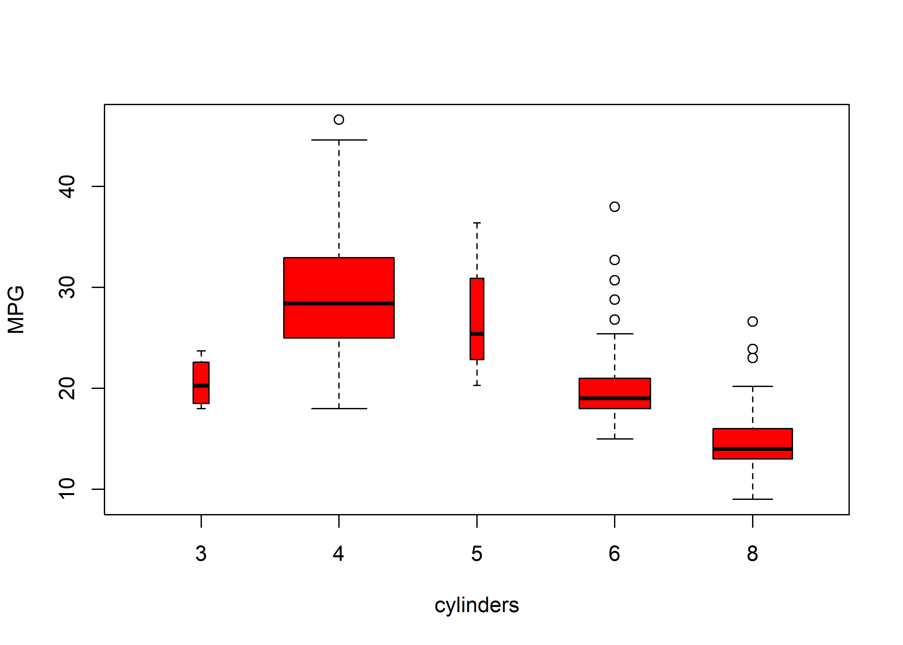
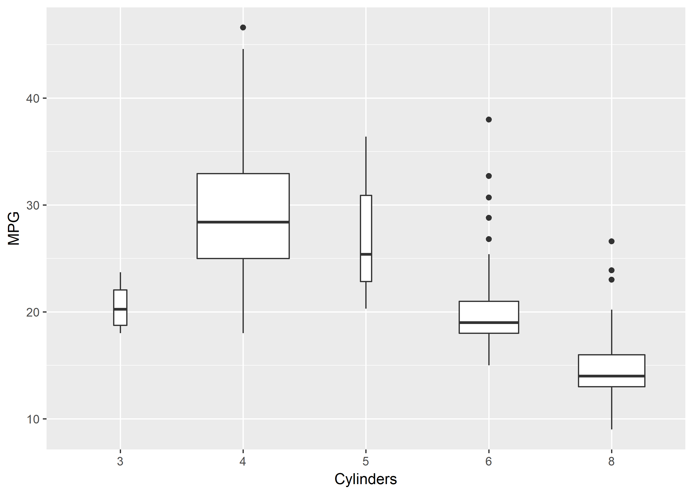

Examples from lab 2 - 4
================
Christopher Oh
2017-07-29

-   [ggplot example](#ggplot-example)
    -   [Original](#original)
    -   [Revised](#revised)
-   [Logistic regression example](#logistic-regression-example)
    -   [Original](#original-1)
    -   [Revised](#revised-1)

``` r
#Libraries to be used.
library(tidyverse)
```

    ## Loading tidyverse: ggplot2
    ## Loading tidyverse: tibble
    ## Loading tidyverse: tidyr
    ## Loading tidyverse: readr
    ## Loading tidyverse: purrr
    ## Loading tidyverse: dplyr

    ## Conflicts with tidy packages ----------------------------------------------

    ## filter(): dplyr, stats
    ## lag():    dplyr, stats

``` r
library(ISLR)
```

ggplot example
--------------

Read in the file

``` r
path_auto_csv <- "C:/Users/logicalfellac/Downloads/ISLR/Auto.csv"
auto <-
  path_auto_csv %>% 
  read_csv(col_names = TRUE, na = "?") %>%
  filter_all(all_vars(!is.na(.))) %>% 
  mutate(cylinders = as.factor(cylinders))
```

    ## Parsed with column specification:
    ## cols(
    ##   mpg = col_double(),
    ##   cylinders = col_integer(),
    ##   displacement = col_double(),
    ##   horsepower = col_integer(),
    ##   weight = col_integer(),
    ##   acceleration = col_double(),
    ##   year = col_integer(),
    ##   origin = col_integer(),
    ##   name = col_character()
    ## )

### Original

``` r
plot(auto$cylinders, auto$mpg, col="red", varwidth=T, xlab="cylinders", ylab="MPG")
```



### Revised

``` r
auto %>%
  ggplot(aes(cylinders, mpg)) +
  geom_boxplot(varwidth = TRUE) +
  labs(
    x = "Cylinders",
    y = "MPG"
  )
```



Logistic regression example
---------------------------

### Original

Separate the training / test set

``` r
attach(Smarket)
train=(Year <2005)
Smarket.2005=Smarket[!train ,]
dim(Smarket.2005)
```

    ## [1] 252   9

``` r
Direction.2005= Direction [!train]
```

Fit the logistic regression model using the training set

``` r
glm.fits=glm(Direction~Lag1+Lag2+Lag3+Lag4+Lag5+Volume ,
             data=Smarket ,family=binomial ,subset=train)
```

Add predictions to the test set

``` r
glm.probs=predict (glm.fits,Smarket.2005, type="response")
glm.pred=rep("Down",252)
glm.pred[glm.probs >.5]="Up"
```

Compute the prediction error

``` r
table(glm.pred ,Direction.2005)
```

    ##         Direction.2005
    ## glm.pred Down Up
    ##     Down   77 97
    ##     Up     34 44

``` r
mean(glm.pred==Direction.2005)
```

    ## [1] 0.4801587

``` r
mean(glm.pred!=Direction.2005)
```

    ## [1] 0.5198413

### Revised

Get the data into a tibble format

``` r
smarket <- as.tibble(Smarket)
```

Separate the training / test set

``` r
train <-
  smarket %>%
  filter(Year < 2005)
test <-
  smarket %>% 
  filter(Year >= 2005)
```

Logistic regression model on the training set

``` r
glm_fit <- 
  glm(
    Direction ~ Lag1 + Lag2 + Lag3 + Lag4 + Lag5 + Volume,
    data = train,
    family = binomial
  )
```

Add prediction to the test set

``` r
test <-
  test %>%
  mutate(
    pred = predict(glm_fit, newdata = test, type = "response"),
    pred_dir = ifelse(pred > .5, "Up", "Down")
  )
```

Calculate the error on the test set

``` r
test %>%
  select(Direction, pred_dir) %>% 
  mutate(err = ifelse(Direction != pred_dir, 1, 0)) %>% 
  summarize(mean(err))
```

    ## # A tibble: 1 x 1
    ##   `mean(err)`
    ##         <dbl>
    ## 1   0.5198413
