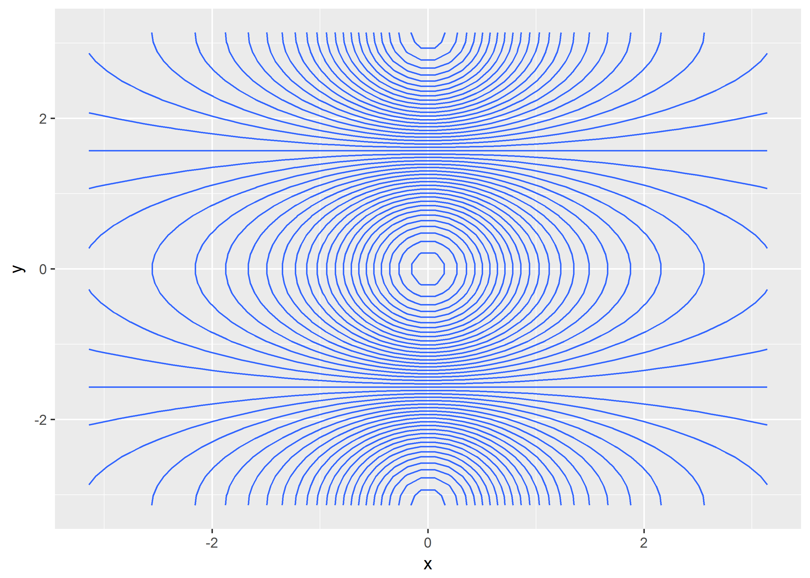

ISLR-Chapter-2-lab
================
Christopher Oh
2017-06-29

-   [2.3 Lab: Introduction to R](#lab-introduction-to-r)
    -   [2.3.1 Basic Commands](#basic-commands)
    -   [2.3.2 Graphics](#graphics)
    -   [2.3.3 Indexing Data](#indexing-data)
    -   [2.3.4 Loading Data](#loading-data)
    -   [2.3.5 Additional Graphical and Numerical Summaries](#additional-graphical-and-numerical-summaries)

``` r
#Libraries to be used.
library(tidyverse)
```

    ## Loading tidyverse: ggplot2
    ## Loading tidyverse: tibble
    ## Loading tidyverse: tidyr
    ## Loading tidyverse: readr
    ## Loading tidyverse: purrr
    ## Loading tidyverse: dplyr

    ## Conflicts with tidy packages ----------------------------------------------

    ## filter(): dplyr, stats
    ## lag():    dplyr, stats

2.3 Lab: Introduction to R
--------------------------

In this lab, we will introduce some simple R commands. The best way to learn a new language is to try out the commands. R can be downloaded from <http://cran.r-project.org/>

"Actually, also download RStudio and other extremeley usefull packages as well. e.g. tidyverse, ggplot2, purrr, stringr, forcats, etc. include the links, etc. We should also introduce the idea of pipes here somewhere."

### 2.3.1 Basic Commands

To run a function named `new_function` with inputs (or arguments) `input1` and `input2`, type `new_function(input1, input2)`.

Here, we are concetanating (`c()`) the numbers 1, 3, 2, 5 into a vector `x`. `<-` is used for assigning the thing on the right to the thing on the left. Typing `x` will give us back the vector.

``` r
x <- c(1, 3, 2, 5)
x
```

    ## [1] 1 3 2 5

Instead of `<-`, `=` can be used for assigning, but using `<-` is preferred. "Typically, `=` is used inside of functions, while `<-` is used in the environment."

``` r
x = c(1, 6, 2)
x
```

    ## [1] 1 6 2

``` r
y = c(1, 4, 3)
```

Hitting the up arrow multiple times will display the previous commands, which can then be edited. This is useful since one often wishes to repeat a similar command. In addition, typing ?funcname will always cause R to open a new help file window with additional information about the function funcname.

We can tell R to add two sets of numbers together. It will then add the first number from x to the first number from y, and so on. However, x and y should be the same length. We can check their length using the length() function.

``` r
length(x)
```

    ## [1] 3

``` r
length(y)
```

    ## [1] 3

``` r
x + y
```

    ## [1]  2 10  5

The ls() function allows us to look at a list of all of the objects, such ls() as data and functions, that we have saved so far. The rm() function can be rm() used to delete any that we don’t want.

``` r
ls()
```

    ## [1] "x" "y"

``` r
rm(x, y)
```

It’s also possible to remove all objects at once:

``` r
rm(list = ls())
```

The matrix() function can be used to create a matrix of numbers. Before matrix() we use the matrix() function, we can learn more about it:

``` r
?matrix
```

The help file reveals that the matrix() function takes a number of inputs, but for now we focus on the first three: the data (the entries in the matrix), the number of rows, and the number of columns. First, we create a simple matrix.

``` r
x <- matrix(data = c(1, 2, 3, 4), nrow = 2, ncol = 2)
x
```

    ##      [,1] [,2]
    ## [1,]    1    3
    ## [2,]    2    4

Note that we could just as well omit typing data =, nrow =, and ncol = in the matrix() command above: that is, we could just type

``` r
x <- matrix(c(1, 2, 3, 4), 2, 2)
```

and this would have the same effect. However, it can sometimes be useful to specify the names of the arguments passed in, since otherwise R will assume that the function arguments are passed into the function in the same order that is given in the function’s help file. As this example illustrates, by default R creates matrices by successively filling in columns. Alternatively, the byrow=TRUE option can be used to populate the matrix in order of the rows.

``` r
matrix(c(1, 2, 3, 4), 2, 2, byrow = TRUE)
```

    ##      [,1] [,2]
    ## [1,]    1    2
    ## [2,]    3    4

Notice that in the above command we did not assign the matrix to a value such as x. In this case the matrix is printed to the screen but is not saved for future calculations. The sqrt() function returns the square root of each sqrt() element of a vector or matrix. The command x^2 raises each element of x to the power 2; any powers are possible, including fractional or negative powers.

``` r
sqrt(x)
```

    ##          [,1]     [,2]
    ## [1,] 1.000000 1.732051
    ## [2,] 1.414214 2.000000

``` r
x ^ 2
```

    ##      [,1] [,2]
    ## [1,]    1    9
    ## [2,]    4   16

The rnorm() function generates a vector of random normal variables, rnorm() with first argument n the sample size. Each time we call this function, we will get a different answer. Here we create two correlated sets of numbers, x and y, and use the cor() function to compute the correlation between cor() them.

``` r
x <- rnorm(50)
y <- x + rnorm(50, mean = 50, sd = .1)
cor(x, y)
```

    ## [1] 0.9945515

By default, rnorm() creates standard normal random variables with a mean of 0 and a standard deviation of 1. However, the mean and standard deviation can be altered using the mean and sd arguments, as illustrated above. Sometimes we want our code to reproduce the exact same set of random numbers; we can use the set.seed() function to do this. The set.seed() function takes an (arbitrary) integer argument.

``` r
set.seed(1303)
rnorm(50)
```

    ##  [1] -1.1439763145  1.3421293656  2.1853904757  0.5363925179  0.0631929665
    ##  [6]  0.5022344825 -0.0004167247  0.5658198405 -0.5725226890 -1.1102250073
    ## [11] -0.0486871234 -0.6956562176  0.8289174803  0.2066528551 -0.2356745091
    ## [16] -0.5563104914 -0.3647543571  0.8623550343 -0.6307715354  0.3136021252
    ## [21] -0.9314953177  0.8238676185  0.5233707021  0.7069214120  0.4202043256
    ## [26] -0.2690521547 -1.5103172999 -0.6902124766 -0.1434719524 -1.0135274099
    ## [31]  1.5732737361  0.0127465055  0.8726470499  0.4220661905 -0.0188157917
    ## [36]  2.6157489689 -0.6931401748 -0.2663217810 -0.7206364412  1.3677342065
    ## [41]  0.2640073322  0.6321868074 -1.3306509858  0.0268888182  1.0406363208
    ## [46]  1.3120237985 -0.0300020767 -0.2500257125  0.0234144857  1.6598706557

We use set.seed() throughout the labs whenever we perform calculations involving random quantities. In general this should allow the user to reproduce our results. However, it should be noted that as new versions of R become available it is possible that some small discrepancies may form between the book and the output from R. The mean() and var() functions can be used to compute the mean and mean() var() variance of a vector of numbers. Applying sqrt() to the output of var() will give the standard deviation. Or we can simply use the sd() function. sd()

``` r
set.seed(3)
y <- rnorm(100)
mean(y)
```

    ## [1] 0.01103557

``` r
var(y)
```

    ## [1] 0.7328675

``` r
sqrt(var(y))
```

    ## [1] 0.8560768

``` r
sd(y)
```

    ## [1] 0.8560768

### 2.3.2 Graphics

The plot() function is the primary way to plot data in R. For instance, plot() plot(x,y) produces a scatterplot of the numbers in x versus the numbers in y. There are many additional options that can be passed in to the plot() function. For example, passing in the argument xlab will result in a label on the x-axis. To find out more information about the plot() function, type ?plot.

"Use ggplot. It's so much better."

``` r
x_1 <- rnorm(100)
y_1 <- rnorm(100)

df <- tibble(x_1, y_1)
df %>% 
  ggplot(aes(x = x_1, y = y_1)) + 
  geom_point()
```


``` r
df %>% 
  ggplot(aes(x = x_1, y = y_1)) + 
  geom_point() +
  labs(
    x = "this is the x-axis",
    y = "this is the y-axis",
    title = "Plot of X vs Y"
  )
```


!!We will often want to save the output of an R plot. The command that we use to do this will depend on the file type that we would like to create. For instance, to create a pdf, we use the pdf() function, and to create a jpeg, pdf() we use the jpeg() function.

"In RStudio, one could easily save the plots using the export feature."

pdf("Figure.pdf") plot(x,y,col="green") dev.off()

The function dev.off() indicates to R that we are done creating the plot. Alternatively, we can simply copy the plot window and paste it into an appropriate file type, such as a Word document.

The function seq() can be used to create a sequence of numbers. For seq() instance, seq(a,b) makes a vector of integers between a and b. There are many other options: for instance, seq(0, 1,length = 10) makes a sequence of 10 numbers that are equally spaced between 0 and 1. Typing 3:11 is a shorthand for seq(3, 11) for integer arguments.

``` r
x <- seq(1, 10)
x <- 1:10
x <- seq(-pi, pi, length = 50)
```

!!We will now create some more sophisticated plots. The contour() function produces a contour plot in order to represent three-dimensional data; contour plot it is like a topographical map. It takes three arguments: 1. A vector of the x values (the first dimension), 2. A vector of the y values (the second dimension), and 3. A matrix whose elements correspond to the z value (the third dimension) for each pair of (x,y) coordinates. As with the plot() function, there are many other inputs that can be used to fine-tune the output of the contour() function. To learn more about these, take a look at the help file by typing ?contour.

``` r
y <- x

df <- tibble(x, y)

df <-
  df %>% 
  expand(x, y) %>% 
  mutate(z = cos(y) / (1 + x ^ 2))

df %>% 
  ggplot(aes(x = x, y = y, z = z)) +
  geom_contour()
```


``` r
df %>% 
  ggplot(aes(x = x, y = y, z = z)) +
  geom_contour(bins = 45)
```



``` r
df %>% 
  mutate(
    t = cos(x) / (1 + y ^ 2),
    w = (z - t) / 2
  ) %>% 
  ggplot(aes(x = x, y = y, z = w)) +
  geom_contour(bins = 15)
```


!!The image() function works the same way as contour(), except that it image() produces a color-coded plot whose colors depend on the z value. This is known as a heatmap, and is sometimes used to plot temperature in weather heatmap forecasts. Alternatively, persp() can be used to produce a three-dimensional persp() plot. The arguments theta and phi control the angles at which the plot is viewed.

``` r
df <-
  df %>% 
  mutate(
    t = cos(x) / (1 + y ^ 2),
    w = (z - t) / 2
  )

df %>% 
  ggplot(aes(x, y)) +
  geom_tile(aes(fill = w)) +
  viridis::scale_fill_viridis()
```


Okay, you think it's cool, but enough with these 3D plots!

"What package(s) should I use here? Plotly, plot3D"

persp(x,y,fa) persp(x,y,fa,theta =30) persp(x,y,fa,theta =30,phi =20) persp(x,y,fa,theta =30,phi =70) persp(x,y,fa,theta =30,phi =40)

### 2.3.3 Indexing Data

We often wish to examine part of a set of data. Suppose that our data is stored in the matrix A.

``` r
a <- matrix(1:16, 4, 4)
```

Then, typing

``` r
a[2, 3]
```

    ## [1] 10

will select the element corresponding to the second row and the third column. The first number after the open-bracket symbol \[ always refers to the row, and the second number always refers to the column. We can also select multiple rows and columns at a time, by providing vectors as the indices.

``` r
a[c(1, 3), c(2, 4)]
```

    ##      [,1] [,2]
    ## [1,]    5   13
    ## [2,]    7   15

``` r
a[1:3, 2:4]
```

    ##      [,1] [,2] [,3]
    ## [1,]    5    9   13
    ## [2,]    6   10   14
    ## [3,]    7   11   15

``` r
a[1:2, ]
```

    ##      [,1] [,2] [,3] [,4]
    ## [1,]    1    5    9   13
    ## [2,]    2    6   10   14

``` r
a[, 1:2]
```

    ##      [,1] [,2]
    ## [1,]    1    5
    ## [2,]    2    6
    ## [3,]    3    7
    ## [4,]    4    8

The last two examples include either no index for the columns or no index for the rows. These indicate that R should include all columns or all rows, respectively. R treats a single row or column of a matrix as a vector.

``` r
a[1,]
```

    ## [1]  1  5  9 13

``` r
a[-c(1, 3), ]
```

    ##      [,1] [,2] [,3] [,4]
    ## [1,]    2    6   10   14
    ## [2,]    4    8   12   16

``` r
a[1,]
```

    ## [1]  1  5  9 13

The use of a negative sign - in the index tells R to keep all rows or columns except those indicated in the index.

``` r
a[-c(1, 3) ,]
```

    ##      [,1] [,2] [,3] [,4]
    ## [1,]    2    6   10   14
    ## [2,]    4    8   12   16

``` r
a[-c(1, 3) ,-c(1, 3, 4)]
```

    ## [1] 6 8

The dim() function outputs the number of rows followed by the number of dim() columns of a given matrix.

``` r
dim(a)
```

    ## [1] 4 4

### 2.3.4 Loading Data

For most analyses, the first step involves importing a data set into R. The read.table() function is one of the primary ways to do this. The help file read.table() contains details about how to use this function. We can use the function write.table() to export data. write. Before attempting to load a data set, we must make sure that table() R knows to search for the data in the proper directory. For example on a Windows system one could select the directory using the Change dir... option under the File menu. However, the details of how to do this depend on the operating system (e.g. Windows, Mac, Unix) that is being used, and so we do not give further details here. We begin by loading in the Auto data set. This data is part of the ISLR library (we discuss libraries in Chapter 3) but to illustrate the read.table() function we load it now from a text file. The following command will load the Auto.data file into R and store it as an object called Auto, in a format referred to as a data frame. (The text file dataframe can be obtained from this book’s website.) Once the data has been loaded, the fix() function can be used to view it in a spreadsheet like window. However, the window must be closed before further R commands can be entered.

``` r
path_auto_text <- "C:/Users/logicalfellac/Downloads/ISLR/Auto.data"
auto <- read_table2(path_auto_text)
```

    ## Warning: Missing column names filled in: 'X10' [10]

    ## Parsed with column specification:
    ## cols(
    ##   mpg = col_double(),
    ##   cylinders = col_integer(),
    ##   displacement = col_double(),
    ##   horsepower = col_character(),
    ##   weight = col_double(),
    ##   acceleration = col_double(),
    ##   year = col_integer(),
    ##   origin = col_integer(),
    ##   name = col_character(),
    ##   X10 = col_character()
    ## )

    ## Warning in rbind(names(probs), probs_f): number of columns of result is not
    ## a multiple of vector length (arg 1)

    ## Warning: 198 parsing failures.
    ## row # A tibble: 5 x 5 col     row   col   expected     actual expected   <int> <chr>      <chr>      <chr> actual 1     1  <NA> 10 columns 11 columns file 2     2  <NA> 10 columns 11 columns row 3     4  <NA> 10 columns 11 columns col 4     6  <NA> 10 columns 11 columns expected 5     8  <NA> 10 columns 11 columns actual # ... with 1 more variables: file <chr>
    ## ... ................. ... ................................... ........ ................................... ...... ................................... .... ................................... ... ................................... ... ................................... ........ ................................... ...... .......................................
    ## See problems(...) for more details.

Note that Auto.data is simply a text file, which you could alternatively open on your computer using a standard text editor. It is often a good idea to view a data set using a text editor or other software such as Excel before loading it into R. This particular data set has not been loaded correctly, because R has assumed that the variable names are part of the data and so has included them in the first row. The data set also includes a number of missing observations, indicated by a question mark ?. Missing values are a common occurrence in real data sets. Using the option header = TRUE in the read.table() function tells R that the first line of the file contains the variable names, and using the option na.strings tells R that any time it sees a particular character or set of characters (such as a question mark), it should be treated as a missing element of the data matrix.

``` r
auto <- read_table2(path_auto_text, col_names = TRUE, na = "?")
```

    ## Warning: Missing column names filled in: 'X10' [10]

    ## Parsed with column specification:
    ## cols(
    ##   mpg = col_double(),
    ##   cylinders = col_integer(),
    ##   displacement = col_double(),
    ##   horsepower = col_double(),
    ##   weight = col_double(),
    ##   acceleration = col_double(),
    ##   year = col_integer(),
    ##   origin = col_integer(),
    ##   name = col_character(),
    ##   X10 = col_character()
    ## )

    ## Warning in rbind(names(probs), probs_f): number of columns of result is not
    ## a multiple of vector length (arg 1)

    ## Warning: 198 parsing failures.
    ## row # A tibble: 5 x 5 col     row   col   expected     actual expected   <int> <chr>      <chr>      <chr> actual 1     1  <NA> 10 columns 11 columns file 2     2  <NA> 10 columns 11 columns row 3     4  <NA> 10 columns 11 columns col 4     6  <NA> 10 columns 11 columns expected 5     8  <NA> 10 columns 11 columns actual # ... with 1 more variables: file <chr>
    ## ... ................. ... ................................... ........ ................................... ...... ................................... .... ................................... ... ................................... ... ................................... ........ ................................... ...... .......................................
    ## See problems(...) for more details.

Excel is a common-format data storage program. An easy way to load such data into R is to save it as a csv (comma separated value) file and then use the read.csv() function to load it in.

``` r
path_auto_csv <- "C:/Users/logicalfellac/Downloads/ISLR/Auto.csv"
auto <- read_csv(path_auto_csv, col_names = TRUE, na = "?")
```

    ## Parsed with column specification:
    ## cols(
    ##   mpg = col_double(),
    ##   cylinders = col_integer(),
    ##   displacement = col_double(),
    ##   horsepower = col_integer(),
    ##   weight = col_integer(),
    ##   acceleration = col_double(),
    ##   year = col_integer(),
    ##   origin = col_integer(),
    ##   name = col_character()
    ## )

``` r
glimpse(auto)
```

    ## Observations: 397
    ## Variables: 9
    ## $ mpg          <dbl> 18, 15, 18, 16, 17, 15, 14, 14, 14, 15, 15, 14, 1...
    ## $ cylinders    <int> 8, 8, 8, 8, 8, 8, 8, 8, 8, 8, 8, 8, 8, 8, 4, 6, 6...
    ## $ displacement <dbl> 307, 350, 318, 304, 302, 429, 454, 440, 455, 390,...
    ## $ horsepower   <int> 130, 165, 150, 150, 140, 198, 220, 215, 225, 190,...
    ## $ weight       <int> 3504, 3693, 3436, 3433, 3449, 4341, 4354, 4312, 4...
    ## $ acceleration <dbl> 12.0, 11.5, 11.0, 12.0, 10.5, 10.0, 9.0, 8.5, 10....
    ## $ year         <int> 70, 70, 70, 70, 70, 70, 70, 70, 70, 70, 70, 70, 7...
    ## $ origin       <int> 1, 1, 1, 1, 1, 1, 1, 1, 1, 1, 1, 1, 1, 1, 3, 1, 1...
    ## $ name         <chr> "chevrolet chevelle malibu", "buick skylark 320",...

``` r
dim(auto)
```

    ## [1] 397   9

The dim() function tells us that the data has 397 observations, or rows, and dim() nine variables, or columns. There are various ways to deal with the missing data. In this case, only five of the rows contain missing observations, and so we choose to use the na.omit() function to simply remove these rows. na.omit()

``` r
auto <-
  auto %>%
  filter_all(all_vars(!is.na(.)))
```

Once the data are loaded correctly, we can use names() to check the names() variable names.

``` r
names(auto)
```

    ## [1] "mpg"          "cylinders"    "displacement" "horsepower"  
    ## [5] "weight"       "acceleration" "year"         "origin"      
    ## [9] "name"

### 2.3.5 Additional Graphical and Numerical Summaries

We can use the plot() function to produce scatterplots of the quantitative scatterplot variables. However, simply typing the variable names will produce an error message, because R does not know to look in the Auto data set for those variables.

``` r
auto %>%
  ggplot(aes(cylinders, mpg)) +
  geom_point()
```


To refer to a variable, we must type the data set and the variable name joined with a $ symbol. Alternatively, we can use the attach() function in attach() order to tell R to make the variables in this data frame available by name.

"No need with ggplot son get those uglyass dollar sign outta here!"

The cylinders variable is stored as a numeric vector, so R has treated it as quantitative. However, since there are only a small number of possible values for cylinders, one may prefer to treat it as a qualitative variable. The as.factor() function converts quantitative variables into qualitative as.factor() variables.

``` r
auto <-
  auto %>%
  mutate(cylinders = as.factor(cylinders))
```

If the variable plotted on the x-axis is categorial, then boxplots will boxplot automatically be produced by the plot() function. As usual, a number of options can be specified in order to customize the plots.

``` r
auto %>%
  ggplot(aes(cylinders, mpg)) +
  geom_point()
```


> plot(cylinders , mpg) plot(cylinders , mpg , col ="red ") plot(cylinders , mpg , col ="red", varwidth =T)

``` r
auto %>%
  ggplot(aes(cylinders, mpg)) +
  geom_boxplot(varwidth = TRUE, color = "red") +
  coord_flip()
```


``` r
auto %>%
  ggplot(aes(cylinders, mpg)) +
  geom_boxplot(varwidth = TRUE, color = "red") +
  labs(
    x = "Cylinders",
    y = "MPG"
  ) +
  coord_flip()
```


The hist() function can be used to plot a histogram. Note that col=2 hist() histogram has the same effect as col="red".

``` r
auto %>%
  ggplot(aes(mpg)) +
  geom_histogram()
```

    ## `stat_bin()` using `bins = 30`. Pick better value with `binwidth`.


``` r
auto %>%
  ggplot(aes(mpg)) +
  geom_histogram(fill = "red")
```

    ## `stat_bin()` using `bins = 30`. Pick better value with `binwidth`.


``` r
auto %>%
  ggplot(aes(mpg)) +
  geom_histogram(fill = "red", bins = 15)
```


``` r
# It's much better to define the width of the bins.
auto %>%
  ggplot(aes(mpg)) +
  geom_histogram(fill = "red", binwidth = 3)
```


The pairs() function creates a scatterplot matrix i.e. a scatterplot for every scatterplot pair of variables for any given data set. We can also produce scatterplots matrix for just a subset of the variables.

``` r
#GGally::ggpairs(auto)
auto %>% 
  GGally::ggpairs(columns = c(1, 3, 4, 5, 6))
```


??? In conjunction with the plot() function, identify() provides a useful identify() interactive method for identifying the value for a particular variable for points on a plot. We pass in three arguments to identify(): the x-axis variable, the y-axis variable, and the variable whose values we would like to see printed for each point. Then clicking on a given point in the plot will cause R to print the value of the variable of interest. Right-clicking on the plot will exit the identify() function (control-click on a Mac). The numbers printed under the identify() function correspond to the rows for the selected points.

``` r
auto %>%
  ggplot(aes(horsepower, mpg)) +
  geom_point()
```


``` r
#identify (horsepower ,mpg ,name)
```

The summary() function produces a numerical summary of each variable in summary() a particular data set.

``` r
summary(auto)
```

    ##       mpg        cylinders  displacement     horsepower        weight    
    ##  Min.   : 9.00   3:  4     Min.   : 68.0   Min.   : 46.0   Min.   :1613  
    ##  1st Qu.:17.00   4:199     1st Qu.:105.0   1st Qu.: 75.0   1st Qu.:2225  
    ##  Median :22.75   5:  3     Median :151.0   Median : 93.5   Median :2804  
    ##  Mean   :23.45   6: 83     Mean   :194.4   Mean   :104.5   Mean   :2978  
    ##  3rd Qu.:29.00   8:103     3rd Qu.:275.8   3rd Qu.:126.0   3rd Qu.:3615  
    ##  Max.   :46.60             Max.   :455.0   Max.   :230.0   Max.   :5140  
    ##   acceleration        year           origin          name          
    ##  Min.   : 8.00   Min.   :70.00   Min.   :1.000   Length:392        
    ##  1st Qu.:13.78   1st Qu.:73.00   1st Qu.:1.000   Class :character  
    ##  Median :15.50   Median :76.00   Median :1.000   Mode  :character  
    ##  Mean   :15.54   Mean   :75.98   Mean   :1.577                     
    ##  3rd Qu.:17.02   3rd Qu.:79.00   3rd Qu.:2.000                     
    ##  Max.   :24.80   Max.   :82.00   Max.   :3.000

``` r
glimpse(auto)
```

    ## Observations: 392
    ## Variables: 9
    ## $ mpg          <dbl> 18, 15, 18, 16, 17, 15, 14, 14, 14, 15, 15, 14, 1...
    ## $ cylinders    <fctr> 8, 8, 8, 8, 8, 8, 8, 8, 8, 8, 8, 8, 8, 8, 4, 6, ...
    ## $ displacement <dbl> 307, 350, 318, 304, 302, 429, 454, 440, 455, 390,...
    ## $ horsepower   <int> 130, 165, 150, 150, 140, 198, 220, 215, 225, 190,...
    ## $ weight       <int> 3504, 3693, 3436, 3433, 3449, 4341, 4354, 4312, 4...
    ## $ acceleration <dbl> 12.0, 11.5, 11.0, 12.0, 10.5, 10.0, 9.0, 8.5, 10....
    ## $ year         <int> 70, 70, 70, 70, 70, 70, 70, 70, 70, 70, 70, 70, 7...
    ## $ origin       <int> 1, 1, 1, 1, 1, 1, 1, 1, 1, 1, 1, 1, 1, 1, 3, 1, 1...
    ## $ name         <chr> "chevrolet chevelle malibu", "buick skylark 320",...

For qualitative variables such as name, R will list the number of observations that fall in each category. We can also produce a summary of just a single variable.

``` r
summary(auto$mpg)
```

    ##    Min. 1st Qu.  Median    Mean 3rd Qu.    Max. 
    ##    9.00   17.00   22.75   23.45   29.00   46.60

Once we have finished using R, we type q() in order to shut it down, or quit. When exiting R, we have the option to save the current workspace so workspace that all objects (such as data sets) that we have created in this R session will be available next time. Before exiting R, we may want to save a record of all of the commands that we typed in the most recent session; this can be accomplished using the savehistory() function. Next time we enter R, we can load that history using the loadhistory() function.
