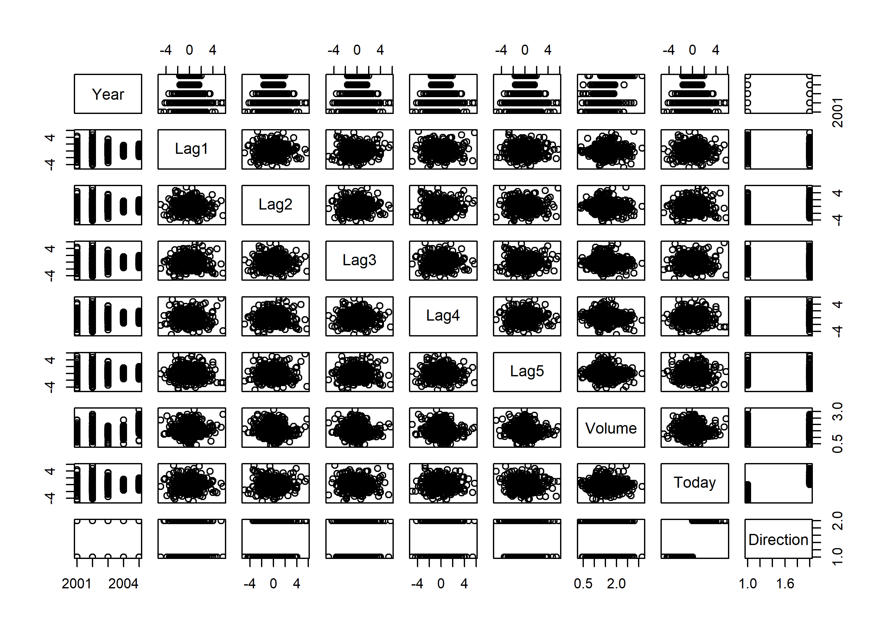
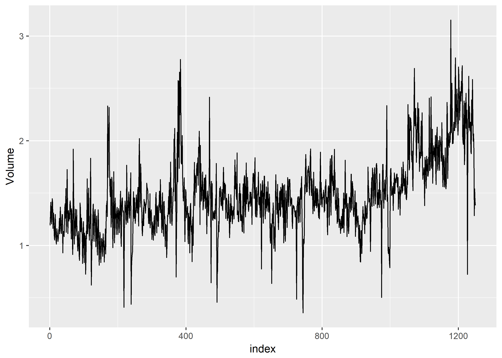

ISLR-Chapter-4-lab
================
Christopher Oh
2017-07-12

-   [Chapter 4 Lab: Logistic Regression, LDA, QDA, and KNN](#chapter-4-lab-logistic-regression-lda-qda-and-knn)
-   [The Stock Market Data](#the-stock-market-data)
-   [Logistic Regression](#logistic-regression)
-   [Linear Discriminant Analysis](#linear-discriminant-analysis)
-   [Quadratic Discriminant Analysis](#quadratic-discriminant-analysis)
-   [K-Nearest Neighbors](#k-nearest-neighbors)
-   [An Application to Caravan Insurance Data](#an-application-to-caravan-insurance-data)

``` r
#Libraries to be used.
library(tidyverse)
```

    ## Loading tidyverse: ggplot2
    ## Loading tidyverse: tibble
    ## Loading tidyverse: tidyr
    ## Loading tidyverse: readr
    ## Loading tidyverse: purrr
    ## Loading tidyverse: dplyr

    ## Conflicts with tidy packages ----------------------------------------------

    ## filter(): dplyr, stats
    ## lag():    dplyr, stats

``` r
library(ISLR)
```

Chapter 4 Lab: Logistic Regression, LDA, QDA, and KNN
=====================================================

The Stock Market Data
=====================

``` r
names(Smarket)
```

    ## [1] "Year"      "Lag1"      "Lag2"      "Lag3"      "Lag4"      "Lag5"     
    ## [7] "Volume"    "Today"     "Direction"

``` r
dim(Smarket)
```

    ## [1] 1250    9

``` r
summary(Smarket)
```

    ##       Year           Lag1                Lag2          
    ##  Min.   :2001   Min.   :-4.922000   Min.   :-4.922000  
    ##  1st Qu.:2002   1st Qu.:-0.639500   1st Qu.:-0.639500  
    ##  Median :2003   Median : 0.039000   Median : 0.039000  
    ##  Mean   :2003   Mean   : 0.003834   Mean   : 0.003919  
    ##  3rd Qu.:2004   3rd Qu.: 0.596750   3rd Qu.: 0.596750  
    ##  Max.   :2005   Max.   : 5.733000   Max.   : 5.733000  
    ##       Lag3                Lag4                Lag5         
    ##  Min.   :-4.922000   Min.   :-4.922000   Min.   :-4.92200  
    ##  1st Qu.:-0.640000   1st Qu.:-0.640000   1st Qu.:-0.64000  
    ##  Median : 0.038500   Median : 0.038500   Median : 0.03850  
    ##  Mean   : 0.001716   Mean   : 0.001636   Mean   : 0.00561  
    ##  3rd Qu.: 0.596750   3rd Qu.: 0.596750   3rd Qu.: 0.59700  
    ##  Max.   : 5.733000   Max.   : 5.733000   Max.   : 5.73300  
    ##      Volume           Today           Direction 
    ##  Min.   :0.3561   Min.   :-4.922000   Down:602  
    ##  1st Qu.:1.2574   1st Qu.:-0.639500   Up  :648  
    ##  Median :1.4229   Median : 0.038500             
    ##  Mean   :1.4783   Mean   : 0.003138             
    ##  3rd Qu.:1.6417   3rd Qu.: 0.596750             
    ##  Max.   :3.1525   Max.   : 5.733000

``` r
pairs(Smarket)
```



``` r
#cor(Smarket)
cor(Smarket[,-9])
```

    ##              Year         Lag1         Lag2         Lag3         Lag4
    ## Year   1.00000000  0.029699649  0.030596422  0.033194581  0.035688718
    ## Lag1   0.02969965  1.000000000 -0.026294328 -0.010803402 -0.002985911
    ## Lag2   0.03059642 -0.026294328  1.000000000 -0.025896670 -0.010853533
    ## Lag3   0.03319458 -0.010803402 -0.025896670  1.000000000 -0.024051036
    ## Lag4   0.03568872 -0.002985911 -0.010853533 -0.024051036  1.000000000
    ## Lag5   0.02978799 -0.005674606 -0.003557949 -0.018808338 -0.027083641
    ## Volume 0.53900647  0.040909908 -0.043383215 -0.041823686 -0.048414246
    ## Today  0.03009523 -0.026155045 -0.010250033 -0.002447647 -0.006899527
    ##                Lag5      Volume        Today
    ## Year    0.029787995  0.53900647  0.030095229
    ## Lag1   -0.005674606  0.04090991 -0.026155045
    ## Lag2   -0.003557949 -0.04338321 -0.010250033
    ## Lag3   -0.018808338 -0.04182369 -0.002447647
    ## Lag4   -0.027083641 -0.04841425 -0.006899527
    ## Lag5    1.000000000 -0.02200231 -0.034860083
    ## Volume -0.022002315  1.00000000  0.014591823
    ## Today  -0.034860083  0.01459182  1.000000000

``` r
#View(Smarket)
Smarket %>% 
  mutate(index = row_number()) %>% 
  ggplot(aes(index, Volume)) +
  geom_line()
```



Logistic Regression
===================

Wrong way

``` r
glm.fits=glm(Direction~Lag1+Lag2+Lag3+Lag4+Lag5+Volume,data=Smarket,family=binomial)
summary(glm.fits)
coef(glm.fits)
summary(glm.fits)$coef
summary(glm.fits)$coef[,4]
glm.probs=predict(glm.fits,type="response")
glm.probs[1:10]
contrasts(Direction)
glm.pred=rep("Down",1250)
glm.pred[glm.probs>.5]="Up"
table(glm.pred,Direction)
(507+145)/1250
mean(glm.pred==Direction)
```

Split into training / test

``` r
train=(Year<2005)
Smarket.2005=Smarket[!train,]
dim(Smarket.2005)
Direction.2005=Direction[!train]
glm.fits=glm(Direction~Lag1+Lag2+Lag3+Lag4+Lag5+Volume,data=Smarket,family=binomial,subset=train)
glm.probs=predict(glm.fits,Smarket.2005,type="response")
glm.pred=rep("Down",252)
glm.pred[glm.probs>.5]="Up"
table(glm.pred,Direction.2005)
mean(glm.pred==Direction.2005)
mean(glm.pred!=Direction.2005)
glm.fits=glm(Direction~Lag1+Lag2,data=Smarket,family=binomial,subset=train)
glm.probs=predict(glm.fits,Smarket.2005,type="response")
glm.pred=rep("Down",252)
glm.pred[glm.probs>.5]="Up"
table(glm.pred,Direction.2005)
mean(glm.pred==Direction.2005)
106/(106+76)
predict(glm.fits,newdata=data.frame(Lag1=c(1.2,1.5),Lag2=c(1.1,-0.8)),type="response")
```

Revised

``` r
smarket <- as.tibble(Smarket)
```

Separate the training / test set

``` r
train <-
  smarket %>%
  filter(Year < 2005)
test <-
  smarket %>% 
  filter(Year >= 2005)
```

Logistic regression model on the training set

``` r
glm_fit <- 
  glm(
    Direction ~ Lag1 + Lag2 + Lag3 + Lag4 + Lag5 + Volume,
    data = train,
    family = binomial
  )
```

Add prediction to the test set

``` r
test <-
  test %>%
  mutate(
    pred = predict(glm_fit, newdata = test, type = "response"),
    pred_dir = ifelse(pred > .5, "Up", "Down")
  )
```

Calculate the error on the test set

``` r
test %>%
  select(Direction, pred_dir) %>% 
  mutate(err = ifelse(Direction != pred_dir, 1, 0)) %>% 
  summarize(mean(err))
```

    ## # A tibble: 1 x 1
    ##   `mean(err)`
    ##         <dbl>
    ## 1   0.5198413

Linear Discriminant Analysis
============================

``` r
library(MASS)
lda.fit=lda(Direction~Lag1+Lag2,data=Smarket,subset=train)
lda.fit
plot(lda.fit)
lda.pred=predict(lda.fit, Smarket.2005)
names(lda.pred)
lda.class=lda.pred$class
table(lda.class,Direction.2005)
mean(lda.class==Direction.2005)
sum(lda.pred$posterior[,1]>=.5)
sum(lda.pred$posterior[,1]<.5)
lda.pred$posterior[1:20,1]
lda.class[1:20]
sum(lda.pred$posterior[,1]>.9)
```

Revised

``` r
library(MASS)
```

    ## 
    ## Attaching package: 'MASS'

    ## The following object is masked from 'package:dplyr':
    ## 
    ##     select

``` r
lda_fit <- lda(Direction ~ Lag1 + Lag2, data = train)
lda_pred <- predict(lda_fit, test)
test %>%
  mutate(lda_pred = lda_pred$class) %>% 
  summarize(accuracy = mean(lda_pred == Direction))
```

    ## # A tibble: 1 x 1
    ##    accuracy
    ##       <dbl>
    ## 1 0.5595238

``` r
test %>%
  mutate(lda_post = lda_pred$posterior[, 1])
```

    ## # A tibble: 252 x 12
    ##     Year   Lag1   Lag2   Lag3   Lag4   Lag5 Volume  Today Direction
    ##    <dbl>  <dbl>  <dbl>  <dbl>  <dbl>  <dbl>  <dbl>  <dbl>    <fctr>
    ##  1  2005 -0.134  0.008 -0.007  0.715 -0.431 0.7869 -0.812      Down
    ##  2  2005 -0.812 -0.134  0.008 -0.007  0.715 1.5108 -1.167      Down
    ##  3  2005 -1.167 -0.812 -0.134  0.008 -0.007 1.7210 -0.363      Down
    ##  4  2005 -0.363 -1.167 -0.812 -0.134  0.008 1.7389  0.351        Up
    ##  5  2005  0.351 -0.363 -1.167 -0.812 -0.134 1.5691 -0.143      Down
    ##  6  2005 -0.143  0.351 -0.363 -1.167 -0.812 1.4779  0.342        Up
    ##  7  2005  0.342 -0.143  0.351 -0.363 -1.167 1.4904 -0.610      Down
    ##  8  2005 -0.610  0.342 -0.143  0.351 -0.363 1.4888  0.398        Up
    ##  9  2005  0.398 -0.610  0.342 -0.143  0.351 1.5621 -0.863      Down
    ## 10  2005 -0.863  0.398 -0.610  0.342 -0.143 1.5103  0.600        Up
    ## # ... with 242 more rows, and 3 more variables: pred <dbl>,
    ## #   pred_dir <chr>, lda_post <dbl>

``` r
sum(lda_pred$posterior[, 1] > .9)
```

    ## [1] 0

Quadratic Discriminant Analysis
===============================

qda.fit=qda(Direction~Lag1+Lag2,data=Smarket,subset=train) qda.fit qda.class=predict(qda.fit,Smarket.2005)$class table(qda.class,Direction.2005) mean(qda.class==Direction.2005)

K-Nearest Neighbors
===================

library(class) train.X=cbind(Lag1,Lag2)\[train,\] test.X=cbind(Lag1,Lag2)\[!train,\] train.Direction=Direction\[train\] set.seed(1) knn.pred=knn(train.X,test.X,train.Direction,k=1) table(knn.pred,Direction.2005) (83+43)/252 knn.pred=knn(train.X,test.X,train.Direction,k=3) table(knn.pred,Direction.2005) mean(knn.pred==Direction.2005)

An Application to Caravan Insurance Data
========================================

dim(Caravan) attach(Caravan) summary(Purchase) 348/5822 standardized.X=scale(Caravan\[,-86\]) var(Caravan\[,1\]) var(Caravan\[,2\]) var(standardized.X\[,1\]) var(standardized.X\[,2\]) test=1:1000 train.X=standardized.X\[-test,\] test.X=standardized.X\[test,\] train.Y=Purchase\[-test\] test.Y=Purchase\[test\] set.seed(1) knn.pred=knn(train.X,test.X,train.Y,k=1) mean(test.Y!=knn.pred) mean(test.Y!="No") table(knn.pred,test.Y) 9/(68+9) knn.pred=knn(train.X,test.X,train.Y,k=3) table(knn.pred,test.Y) 5/26 knn.pred=knn(train.X,test.X,train.Y,k=5) table(knn.pred,test.Y) 4/15 glm.fits=glm(Purchase~.,data=Caravan,family=binomial,subset=-test) glm.probs=predict(glm.fits,Caravan\[test,\],type="response") glm.pred=rep("No",1000) glm.pred\[glm.probs&gt;.5\]="Yes" table(glm.pred,test.Y) glm.pred=rep("No",1000) glm.pred\[glm.probs&gt;.25\]="Yes" table(glm.pred,test.Y) 11/(22+11)
